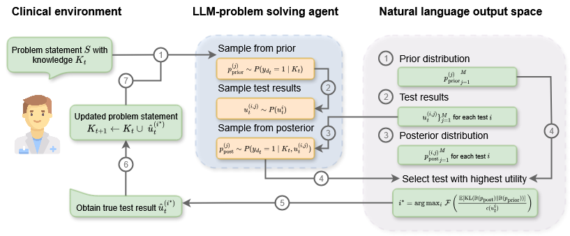

# ACT-Med: Timely Clinical Diagnosis (NeurIPS 2025)

<p align="center">
	
</p>

<p align="center">
	<b>Authors:</b> Silas RUhrberg Estevez · Nicolas Astorga · Mihaela van der Schaar
</p>

<p align="center">
	<a href="#paper">Paper (coming soon)</a> •
	<a href="#citation">BibTeX</a> •
	<a href="#getting-started">Getting Started</a> •
	<a href="#experiments">Experiments</a> •
	<a href="#results">Results</a>
</p>

---

ACT-Med is a framework for timely clinical diagnosis, combining structured datasets, simulated OSCE-style assessments, and principled uncertainty-aware evaluation. This repository contains the code, environment, data layout, and scripts to reproduce the experiments and figures in the NeurIPS 2025 paper.

## Highlights

- Timely clinical diagnosis benchmark across multiple conditions (e.g., diabetes, hepatitis, kidney)
- OSCE-style evaluations for realistic, stepwise clinical reasoning
- Support for multiple model backends and reproducible seeds
- Ready-to-use Conda environment via `actmed_environment.yml`
- Clear outputs under `results/` for main, sampling, and entropy-based analyses

## Getting Started

### 1) Environment (Conda)

Create and activate the environment from the provided spec:

```bash
conda env create -f actmed_environment.yml
conda activate actmed
```

If you run into conflicts, try updating Conda/Mamba and re-creating the env. The environment is tailored for Linux with CUDA support; CPU-only is possible by removing GPU-specific packages.

### 2) Data layout

This repo expects data in the `data/` folder. A sample CSV is already provided for diabetes.

```
actmed/
	data/
		diabetes/
			diabetes.csv
		hepatitis/
			... (place files here)
		kidney/
			... (place files here)
		osce/
			... (OSCE evaluation materials)
```

- Place additional datasets into their respective subfolders.
- Ensure file names and formats match what the loaders in `lib/datasets.py` expect.

## Experiments

We provide shell scripts in `src/` to launch experiments. These scripts spin up parallel runs using GNU Screen and currently use absolute paths that you should adapt to your machine.

- `src/runExperiment.sh` — main experiments (condition classification)
- `src/runOSCEs.sh` — OSCE-style assessments
- `src/runSamplig.sh` — sampling analyses (typo in filename is intentional to match the existing file)

Before running, open the scripts and update any absolute paths (e.g., references to `/home/sr933/...`). Then execute, for example:

```bash
bash src/runExperiment.sh
```

The scripts will launch detached screen sessions per (task, model, seed) and wait until all runs complete.

### Environment variables (OpenAI)

This repo uses the standard OpenAI client and enforces the `gpt-4o` model. Set the following in your shell (bash):

```bash
# Required
export OPENAI_API_KEY="sk-..."

# Optional: only if you go through a proxy/self-hosted gateway
export OPENAI_BASE_URL="https://api.openai.com/v1"  # default shown
```
# Path to conda.sh
CONDA_PATH="/home/sr933/miniconda/etc/profile.d/conda.sh"


Notes
- `lib/model.py` reads `OPENAI_API_KEY`. As a convenience, it will also accept `GPT_4O_KEY` if you already have that set.
- Only `gpt-4o` is supported. Supplying other model names will raise an error.
- You can put these in a `.env` file for local development.

Quick start with a template:

```bash
cp .env.example .env
# then edit .env with your key
```

## Results

All outputs are written to `results/`:

- `results/main/` — primary experiment outputs
- `results/sampling/` — sampling-based analyses
- `results/entropy/` — entropy/uncertainty analyses

If you want to keep figures or intermediate artifacts, check `analysis/` (e.g., `analysis/Figure1.py`) for figure generation utilities.

## Repository structure

- `lib/` — core library code (datasets, models, OSCE evaluation, helpers)
- `analysis/` — analysis and plotting scripts (paper figures)
- `src/` — experiment launch scripts
- `data/` — datasets (see layout above)
- `results/` — experiment outputs (auto-generated)

## Paper

- Title: Timely Clinical Diagnosis (NeurIPS 2025)
- Link: coming soon

We will update this section with the camera-ready link (arXiv and/or OpenReview) once available.

## Citation

If you find this work useful, please cite it. A final BibTeX entry will be provided upon publication. For now, you can use the placeholder below and update fields later:

```bibtex
@inproceedings{ruhrberg2025timely,
	title     = {Timely Clinical Diagnosis},
	author    = {Silas RUhrberg Estevez and Nicolas Astorga and Mihaela van der Schaar},
	booktitle = {Advances in Neural Information Processing Systems (NeurIPS)},
	year      = {2025},
	note      = {To appear},
	url       = {https://arxiv.org/abs/TODO}
}
```

## License

License will be added upon publication. Until then, all rights reserved.

## Acknowledgements

We thank collaborators and the broader clinical ML community for feedback and discussions. Please open an issue if you encounter any problems or have suggestions.

---

Questions or requests? Feel free to open an issue or discussion thread in this repository.

